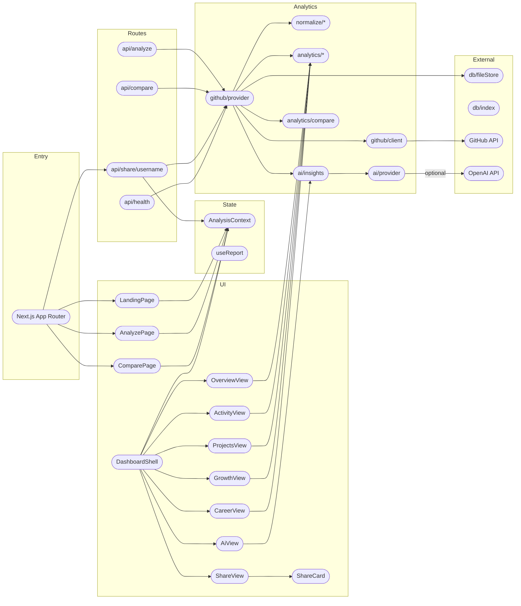

# DevLens

> Evidence-based developer intelligence for any GitHub profile

[](https://github.com/devlens/devlens)
[](https://github.com/devlens/devlens)
[](https://opensource.org/licenses/MIT)
[](https://github.com/devlens/devlens)

## The Problem

You've spent years building on GitHub — but your own profile is just a pile of stars, repos, and commit counts. No hiring manager, teammate, or recruiter reads that data and sees a story. Existing dashboard tools either show vanity stats or generate flattering-but-fake AI summaries with no accountability. You have no way to see your real growth trajectory, project health, or career-readiness gaps from your actual public work.

## What DevLens Does

Paste any public GitHub username or profile URL into DevLens and get a 0–100 Developer Intelligence Score computed only from measurable, labeled data — GitHub-reported metrics separated from DevLens-calculated ones. You get an evidence-gated AI developer profile (no hallucinated claims — every strength, weakness, and recommendation is traceable to a metric), a career readiness breakdown across six roles with specific skill-gap analysis, and a shareable profile card that tells your real story. It falls back to deterministic demo data when GitHub's API is unreachable, so the experience never breaks.

## Key Features

- **Know your real weak spots** — 0–100 Developer Intelligence Score broken into activity, consistency, diversity, collaboration, and growth sub-scores, each with a factual basis
- **Stop guessing about your projects** — per-repository health scoring with commit recency, community attention, issue hygiene, and licensing signals
- **See your tech evolution over time** — language share trends across time intervals with rising/declining technology detection
- **Get honest career guidance** — role-readiness scores for six developer roles with specific skill-gap identification and next-step recommendations
- **Compare without bias** — side-by-side profile comparison with explicit disclaimers about what the metrics (and don't) mean
- **Share your real profile** — public developer card with score, top technologies, persona, and an instant shareable URL
- **No fake AI narratives** — every AI claim is backed by a measured data point; LLM enrichment is optional and constrained

## Architecture



## Tech Stack

| Layer | Technology |
|-------|-----------|
| Framework | Next.js 14 (App Router) |
| Language | TypeScript |
| Styling | Tailwind CSS |
| Icons | Lucide React |
| Charts | Custom SVG components |
| GitHub API | REST API (server-side) |
| AI | Deterministic engine + optional OpenAI GPT-4o-mini |
| Cache | Filesystem JSON with configurable TTL |

## Getting Started

### Prerequisites

- Node.js 18+
- npm
- A GitHub token (optional but recommended — raises rate limits from 60/hr to 5,000/hr)
- An OpenAI API key (optional — enables richer AI narratives)

### Installation

1. Clone the repository:
   ```bash
   git clone https://github.com/devlens/devlens.git
   cd devlens
   ```

2. Install dependencies:
   ```bash
   npm install
   ```

3. Set up environment variables:
   ```bash
   cp .env.local.example .env.local
   ```
   Edit `.env.local` and add your `GITHUB_TOKEN` (and optionally `OPENAI_API_KEY`).

4. Start the dev server:
   ```bash
   npm run dev
   ```

Open [http://localhost:3000](http://localhost:3000).

### Verification Commands

```bash
npm run typecheck
npm run build
npm run lint
```

## Project Structure

```
devlens/
├── .env.local.example          # Environment template
├── .gitignore
├── next.config.mjs             # Next.js config
├── package.json                # Dependencies & scripts
├── tsconfig.json               # TypeScript config
├── tailwind.config.ts          # Tailwind config
├── postcss.config.mjs          # PostCSS config
├── README.md                   # This file
├── LICENSE                     # MIT license
└── src/
    ├── app/                    # Next.js App Router
    │   ├── layout.tsx          # Root layout + styles
    │   ├── page.tsx            # Landing page
    │   ├── analyze/page.tsx    # Progress screen
    │   ├── dashboard/          # All dashboard views
    │   ├── compare/page.tsx    # Comparison page
    │   ├── share/[username]/page.tsx  # Public profile
    │   └── api/                # Server-side API routes
    ├── components/
    │   ├── ui/                 # Reusable UI primitives
    │   ├── charts/             # SVG chart components
    │   ├── dashboard/          # Dashboard views
    │   └── landing/
    ├── context/
    │   └── AnalysisContext.tsx # Global state
    └── lib/                    # Core logic
        ├── types.ts            # Domain types
        ├── github/client.ts    # GitHub API client
        ├── github/provider.ts  # Analysis pipeline
        ├── github/mock.ts      # Demo data
        ├── normalize/          # Data normalization
        ├── analytics/          # Scoring & analysis engine
        ├── ai/                 # Evidence-based AI insights
        └── db/                 # Filesystem cache
```

## Contributing

Found a bug or want to improve the analytics? Fork the repo, create a branch, and open a pull request. All metrics must stay transparent and evidence-based.

## License

MIT — see [LICENSE](./LICENSE)
